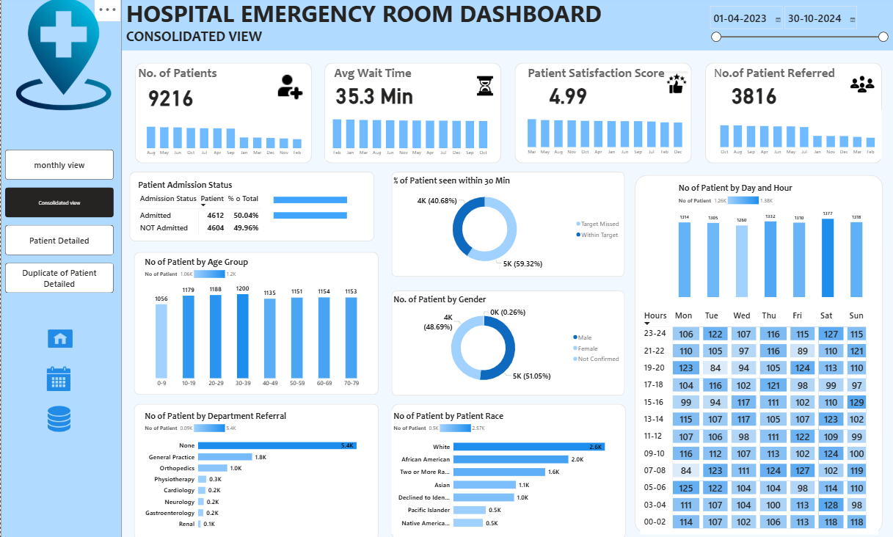

#  Hospital Emergency Room Dashboard - Power BI Project

This project presents an insightful **Power BI Dashboard** analyzing patient data from a hospital emergency room (ER). It provides both **consolidated** and **monthly views** of key healthcare performance indicators to support hospital management in resource planning, service optimization, and patient satisfaction monitoring.

---

##  Key Metrics Tracked

- **Total No. of Patients:** 9216 (Consolidated View)
- **Average Wait Time:** 35.3 minutes
- **Patient Satisfaction Score:** 4.99 (Avg.)
- **Patients Referred:** 3816
- **% Seen Within 30 Min:** 59.32% within target
- **Gender Split:** Male 48.69%, Female 51.05%

---

##  Monthly View (Example: Aug 2024)

- **No. of Patients in August 2024:** 530
- **Avg. Wait Time:** 35.1 minutes
- **Patient Satisfaction Score:** 5.18
- **Referral Count:** 223
- **Patients Seen Within 30 Min:** 60.94%
- **Most Active ER Hours:** 09:00–11:00 AM, especially on Fridays and Saturdays

---

##  Dashboard Features

##  Consolidated View

- Patient trend by month (volumes, wait time, referrals, satisfaction)
- Admission status breakdown (Admitted vs. Not Admitted)
- Age group-wise patient volume
- ER visits by gender, race, department referral
- Time heatmap of patient visits by day and hour

###  Monthly View

- Daily-level patient trends
- Performance tracking for a selected month
- Quick analysis of departmental and racial patient distribution
- Drilldown into high-volume hours/days for scheduling decisions

---

##  Patient Characteristics Captured

- **Age Group** (e.g., 0–9, 10–19, 20–29... 70–79)
- **Gender** (Male, Female, Not Confirmed)
- **Race** (White, African American, Asian, Native American, etc.)
- **Referral Departments** (General Practice, Cardiology, Orthopedics, etc.)

---

##  Tools & Technologies

- **Power BI** for interactive dashboards and reporting
- **Power Query Editor** for data cleansing and transformation
- **DAX** for dynamic metrics like satisfaction %, admission %, and target tracking
- **Heatmaps, Donut Charts, KPIs, and Time Series Plots**

---

##  Use Cases

- Hospital administration & performance monitoring
- Staff scheduling and resource planning based on peak hour trends
- Enhancing patient satisfaction and reducing wait times
- Identifying underserved departments or patient demogra

##  Dataset Info

The dataset simulates ER patient visit records between **April 2023 to October 2024**, capturing admission status, age, gender, department referral, race, visit timing, and satisfaction metrics.

---

##  Dashboard Previews

##  Consolidated View  

##  Monthly View - August 2024  

---

##  Contributions

Feel free to fork, suggest improvements, or use this layout for your healthcare reporting needs.

---

##  License

This project is for educational, analytics, and visualization demonstration purposes only.

